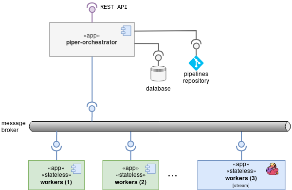

poc-piper-worker-flink
======================

[](https://app.codacy.com/app/ccamel/poc-piper-worker-flink?utm_source=github.com&utm_medium=referral&utm_content=ccamel/poc-piper-worker-flink&utm_campaign=Badge_Grade_Dashboard) [](https://stackshare.io/ccamel/poc-piper-worker-flink)
[](https://scala-steward.org)

> An experiment :alembic: to make [flink][] a worker for the workflow engine [piper][].

## Description

[piper] is an open-source, distributed workflow engine designed to be dead simple.

This project demonstrates the great capability of [piper][] to integrate with [flink][], the stream-processing framework from the [Apache Software Foundation](https://en.wikipedia.org/wiki/Apache_Software_Foundation).

The integration is achieved by designing a Flink Data Stream able to communicate with [piper][] through [RabitMQ](https://www.rabbitmq.com/).



## Build

```sh
sbt clean package
```

[flink]: https://flink.apache.org/
[piper]: https://github.com/creactiviti/piper

[Chris Camel]: https://github.com/ccamel
[MIT]: https://tldrlegal.com/license/mit-license
